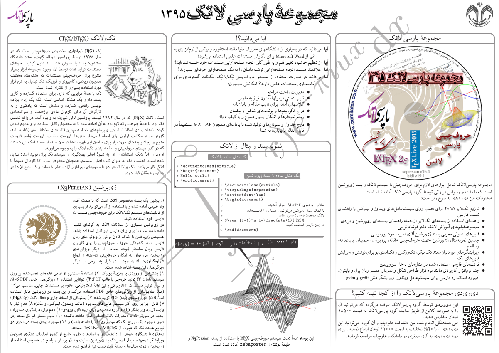

# ParsiLaTeX-DVD-Flyer
ParsiLaTeX DVD was a software bundle including the latest version of TeXLive and some other materials for Persian users of LaTeX. This flyer was typeset with xebaposter to advertise that bundle on the ancient era of DVD!

### Courtesy to
This flyer is wholly inspired by the work of Dr. [Mahmood Amintoosi](https://mamintoosi.github.io/) around advertising the ParsiLaTeX DVD in a poster with the aid of [`xebaposter`](https://ctan.org/pkg/xebaposter?lang=en). 

